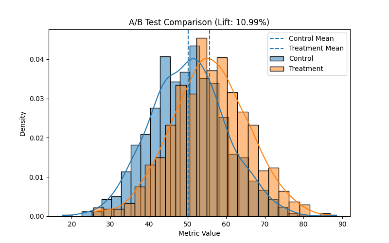

# A/B Testing Case Study: Measuring Treatment Impact and Business Lift

## Overview
This project presents an end-to-end A/B testing analysis designed to evaluate whether a treatment leads to a statistically significant and practically meaningful improvement in a key performance metric.

The analysis combines statistical rigor with business interpretation, demonstrating how experimental results can inform data-driven decision-making.

---

## Objective
To determine whether a treatment variant produces a measurable and statistically significant improvement over a control group, and to assess whether the effect is meaningful from a business perspective.

---

## Methodology
The analysis follows a structured experimental workflow:

- Simulated control and treatment groups
- Independent two-sample t-test for statistical significance
- Effect size (Cohen’s d) to measure magnitude of impact
- Percent lift to quantify business improvement
- 95% confidence intervals to estimate uncertainty
- Power analysis to evaluate test strength
- Bootstrapping to validate results without distributional assumptions
- Data visualization for distribution comparison

---

## Key Results

- **Statistically significant difference** (p < 0.001)
- **~11% lift** in the treatment group
- **Moderate effect size** (Cohen’s d ≈ 0.56)
- Confidence intervals confirm a consistent positive effect
- Bootstrap results closely align with parametric estimates
- Power ≈ 1.0, indicating a well-powered test

---

## Visualization

The treatment distribution shows a clear rightward shift compared to the control group, indicating improved performance across observations.

---

## Interpretation

The treatment demonstrates a statistically significant and practically meaningful improvement over the control group. The consistency between parametric and bootstrap confidence intervals suggests that the result is robust and not driven by distributional assumptions.

While some overlap exists between the groups, the overall shift in distribution indicates a sustained performance increase rather than isolated outliers.

---

## Business Insight

The observed lift and effect size suggest that the treatment has meaningful impact and warrants consideration for deployment. 

In a real-world setting, the next steps would include:
- Evaluating implementation cost
- Monitoring post-deployment performance
- Validating results across different user segments

---

## Tools & Technologies

- Python  
- pandas  
- numpy  
- scipy  
- matplotlib  
- seaborn  

---

## Project Structure
ab-testing-case-study-measuring-treatment-impact-and-business-lift/
│
├── src/
│ └── analysis.py
├── outputs/
│ └── ab_testing_plot.png
├── requirements.txt
└── README.md

---

## Key Takeaways

- Statistical significance should be paired with effect size and business context
- Confidence intervals provide more insight than p-values alone
- Bootstrapping offers a robust alternative to parametric assumptions
- A/B testing is most valuable when tied to real business decisions

---

## Author

**Alexandria Green**
